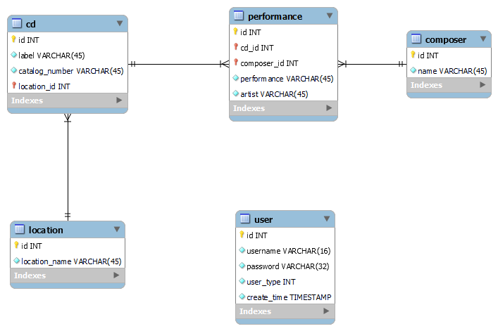

# HomeCD

A simple CD catalog allowing one to file locate and search for CDs. In general the project tries to solve the problems
of: how many CDSs are at any particular location; what recordings exist by composer and/or specific performances exist
and what location may individual CDs be found.

## Authors

David Johnson david2joh@gmail.com

## Usage

to start the application the user should create an account by clicking on the "Register New User link on the login page

## License

This project is licensed under the MIT License.

## Links

The GitHub repository for this application may be found at https://github.com/david2joh/homeCD

## Technologies

Java, SpringBoot, JPA, JUnit, Bootstrap, HTML, CSS, Javascript, jQuery, MySQL DB, SQL

## Entity Relationship Diagram

