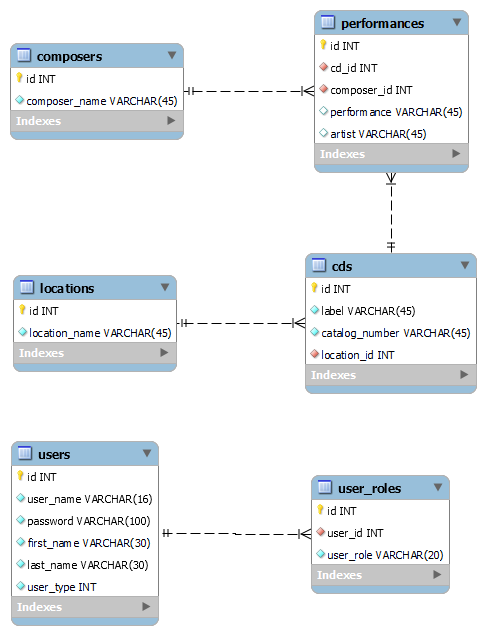

# HomeCD

A simple CD catalog allowing one to file loacte and search for CDs.  In general the project tries to solve the problems of: how many CDSs are at any particular location; what recordings exist by composer and or specific performances exist and what location may individual CDs be found.

## Authors

David Johnson david2joh@gmail.com

## Usage

to start the application the user should create an aacount by clicking on the "REgister New User link on the login page

## License

This project is licensed under the MIT LIcense.
## Links
The GitHub repository for this appplication may be found at https://github.com/david2joh/homeCD
## Technologies

Java, SpringBoot, JPA, JUnit, Bootstrap, HTML, CSS, Javascript, jQuery, MySQL DB, SQL
## Entity Relationship Diagram
